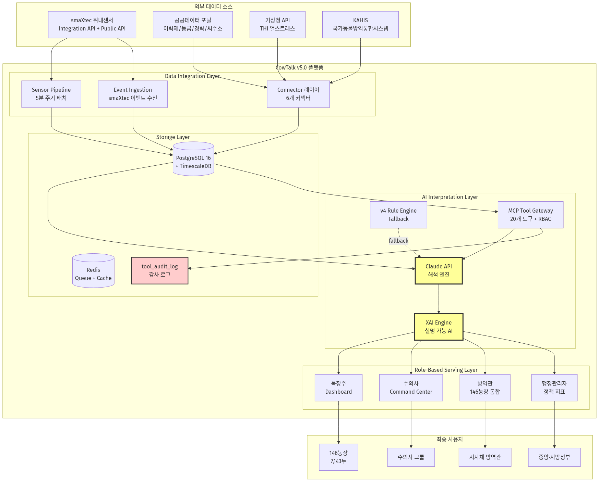
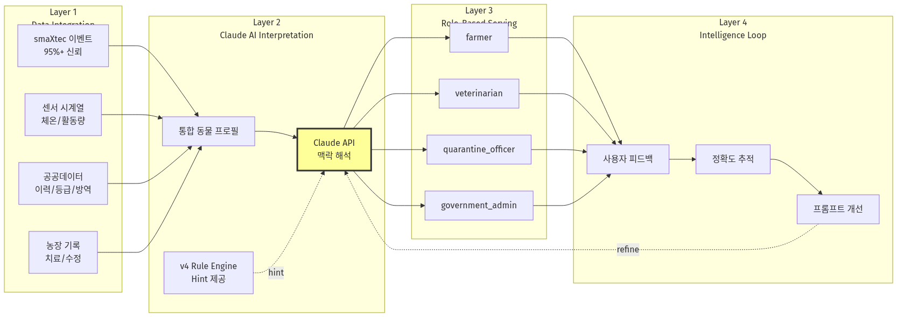
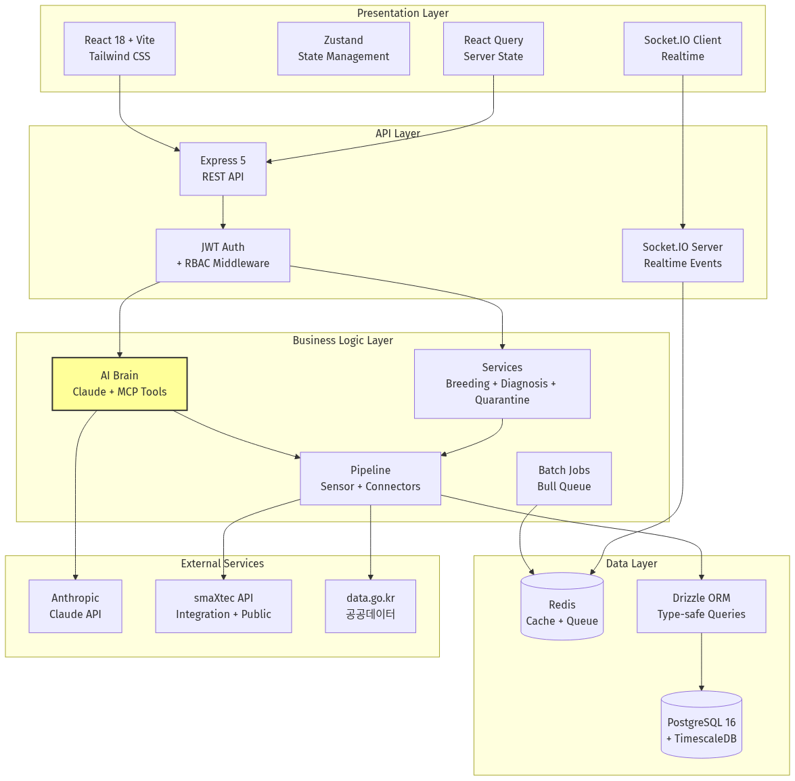
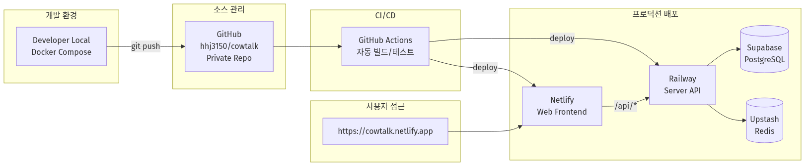
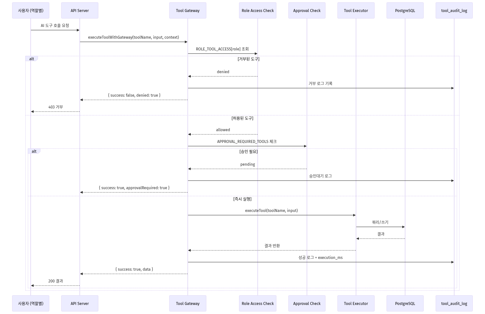

# CowTalk v5.0 계획서 보강 자료
## 항목 #33 · #34 · #35

**문서 버전**: 1.0
**작성일**: 2026-04-11
**작성처**: D2O Corp
**용도**: 사업 계획서 기술 보강 자료 (시스템 구성도 · MCP 도구 명세 · XAI 스키마)

---

## 목차

- [33. CowTalk v5.0 시스템 아키텍처 다이어그램](#33-cowtalk-v50-시스템-아키텍처-다이어그램)
- [34. MCP 20도구 상세 명세 + 역할별 접근 권한 매트릭스](#34-mcp-20도구-상세-명세--역할별-접근-권한-매트릭스)
- [35. XAI 스키마 및 샘플 응답](#35-xai-스키마-및-샘플-응답)

---

# 33. CowTalk v5.0 시스템 아키텍처 다이어그램

## 33.1 전체 시스템 구성도



## 33.2 4-Layer AI Pipeline 데이터 흐름



## 33.3 기술 스택 계층도



## 33.4 배포 인프라 구성도



---

# 34. MCP 20도구 상세 명세 + 역할별 접근 권한 매트릭스

## 34.1 MCP 도구 체계 개요

CowTalk v5.0의 AI 어시스턴트 "팅커벨"은 **MCP(Model Context Protocol) 20개 도구**를 통해 DB · 공공데이터 · 외부 API에 안전하게 접근합니다. 모든 도구 호출은 3단계 게이트웨이를 통과합니다:

1. **역할 기반 접근 제어** (ROLE_TOOL_ACCESS 화이트리스트)
2. **승인 필요 여부** (APPROVAL_REQUIRED_TOOLS — 공개 알림/관리 공지 등)
3. **감사 로그 기록** (모든 호출 `tool_audit_log` 테이블 자동 기록)

**도메인 분류**: sensor(4) / farm(3) / repro(5) / public_data(5) / genetics(1) / health(2) = 총 20개

## 34.2 20개 도구 상세 명세

### 도메인 1: Sensor (4개)

| # | Tool Name | 유형 | 입력 스키마 | 설명 |
|---|---|---|---|---|
| 1 | `query_animal` | 조회 | earTag / traceId / animalId (1개 필수) | 개체 정보 조회. 품종·산차·착유일수·농장·번식상태 프로필 반환 |
| 2 | `query_animal_events` | 조회 | animalId (필수), eventTypes[], limit | 개체 이벤트 이력. 발정·수정·임신감정·분만·건강 알림을 시간순 반환 |
| 5 | `query_sensor_data` | 조회 | animalId (필수), metric (temperature/activity/rumination/water_intake/ph), days (기본 7), includeHourlyPattern | 개체 센서 데이터. 일별 집계 + 개체별 기준선 + 품종/산차/DIM 보정 임계값 반환 |
| 11 | `query_weather` | 조회 | farmId | 기상 + THI. 기온·습도·THI 등급(정상/주의/위험/긴급) 반환. 열스트레스 판단용 |

### 도메인 2: Farm (3개)

| # | Tool Name | 유형 | 입력 스키마 | 설명 |
|---|---|---|---|---|
| 3 | `query_farm_summary` | 조회 | farmId / farmName (1개 필수) | 농장 요약. 두수·활성 알림 수·번식 KPI 반환 |
| 17 | `record_treatment` | 기록 | animalId (필수), diagnosis (필수), severity, drug, dosage, route (IM/IV/SC/PO/topical/intramammary), frequency, durationDays, withdrawalDays, rectalTemp, cmtResult, bcs, hydrationLevel, affectedQuarter, notes | 치료 기록. 진단·투약·임상소견·휴약기간 기록 |
| 18 | `get_farm_kpis` | 조회 | farmId (필수) | 농장 핵심 KPI. 두수·번식성적·최근 알림·건강 이벤트 요약 |

### 도메인 3: Reproduction (5개)

| # | Tool Name | 유형 | 입력 스키마 | 설명 |
|---|---|---|---|---|
| 4 | `query_breeding_stats` | 조회 | farmId | 번식 통계. 수태율·발정탐지율·평균공태일·분만간격·임신율 KPI |
| 6 | `query_conception_stats` | 조회 | farmId | 수태율 통계. 정액별·개체별 수태율·반복번식우·개선 추이 |
| 14 | `record_insemination` | 기록 | animalId (필수), farmId (필수), semenInfo, semenId, technicianName, notes | 수정 기록. 인공수정 결과를 정액·수정사와 함께 기록 |
| 15 | `record_pregnancy_check` | 기록 | animalId (필수), result (pregnant/open, 필수), method (ultrasound/manual/blood), daysPostInsemination, notes | 임신감정 결과. 초음파/직장검사/혈액검사로 임신 여부 확정 |
| 16 | `recommend_insemination_window` | 추천 | animalId (필수), heatDetectedAt | 수정 적기 추천. 최적 수정 시간·추천 정액·목장별 번식 설정 반영 |

### 도메인 4: Public Data (5개)

| # | Tool Name | 유형 | 입력 스키마 | 설명 |
|---|---|---|---|---|
| 7 | `query_traceability` | 조회 | traceId (12자리, 필수) | 이력제 실시간 조회. EKAPE에서 출생·이동이력·백신·방역검사 |
| 8 | `query_grade` | 조회 | traceId (12자리, 필수) | 등급판정 실시간 조회. 소도체 등급·육질·육량·도체중·판정일·도축장 |
| 9 | `query_auction_prices` | 조회 | startDate (YYYYMMDD), endDate (YYYYMMDD), breed (한우/육우/젖소) | 경락가격. 품종·등급별 평균/최고/최저(원/kg) |
| 12 | `query_quarantine_dashboard` | 조회 | (없음) | 방역 대시보드. 전국 감시 두수·발열률·집단발열 농장·위험등급·TOP5·24시간 추이 |
| 13 | `query_national_situation` | 조회 | province (시도명) | 전국 방역 현황. 시도별 농장 수·두수·발열률·위험등급 |

### 도메인 5: Genetics (1개)

| # | Tool Name | 유형 | 입력 스키마 | 설명 |
|---|---|---|---|---|
| 10 | `query_sire_info` | 조회 | (없음) | 한우 씨수소 정보. 농촌진흥청 공공데이터에서 씨수소 번호·이름·혈통·근교계수 조회 (한우 전용) |

### 도메인 6: Health / Veterinary (2개)

| # | Tool Name | 유형 | 입력 스키마 | 설명 |
|---|---|---|---|---|
| 19 | `query_differential_diagnosis` | 분석 | animalId (필수), symptoms[] | **감별진단**. 센서·건강이력·농장 패턴 → 6개 질병 확률 순위 + 센서 근거 + 확인검사 트리 (수의사 필수) |
| 20 | `confirm_treatment_outcome` | 기록 | treatmentId (필수), outcome (recovered/relapsed/worsened, 필수), notes | 치료 결과 확인. 수의사가 치료 후 경과(완치/재발/악화) 확정 기록 |

## 34.3 역할별 접근 권한 매트릭스 (20 × 4)

**✓ = 접근 허용, ✗ = 접근 거부 (게이트웨이 차단)**

| # | 도구명 | 도메인 | Farmer | Veterinarian | Government Admin | Quarantine Officer |
|---|---|---|:---:|:---:|:---:|:---:|
| 1 | query_animal | sensor | ✓ | ✓ | ✓ | ✓ |
| 2 | query_animal_events | sensor | ✓ | ✓ | ✗ | ✓ |
| 3 | query_farm_summary | farm | ✓ | ✓ | ✓ | ✓ |
| 4 | query_breeding_stats | repro | ✓ | ✓ | ✓ | ✗ |
| 5 | query_sensor_data | sensor | ✓ | ✓ | ✗ | ✓ |
| 6 | query_conception_stats | repro | ✓ | ✓ | ✗ | ✗ |
| 7 | query_traceability | public_data | ✓ | ✓ | ✓ | ✓ |
| 8 | query_grade | public_data | ✓ | ✓ | ✓ | ✗ |
| 9 | query_auction_prices | public_data | ✓ | ✗ | ✓ | ✗ |
| 10 | query_sire_info | genetics | ✓ | ✓ | ✗ | ✗ |
| 11 | query_weather | sensor | ✓ | ✓ | ✗ | ✓ |
| 12 | query_quarantine_dashboard | public_data | ✗ | ✗ | ✓ | ✓ |
| 13 | query_national_situation | public_data | ✗ | ✗ | ✓ | ✓ |
| 14 | record_insemination | repro | ✓ | ✓ | ✗ | ✗ |
| 15 | record_pregnancy_check | repro | ✓ | ✓ | ✗ | ✗ |
| 16 | recommend_insemination_window | repro | ✓ | ✓ | ✗ | ✗ |
| 17 | record_treatment | farm | ✓ | ✓ | ✗ | ✗ |
| 18 | get_farm_kpis | farm | ✓ | ✓ | ✓ | ✓ |
| 19 | query_differential_diagnosis | health | ✓ | ✓ | ✗ | ✗ |
| 20 | confirm_treatment_outcome | health | ✓ | ✓ | ✗ | ✗ |
| | **접근 가능 도구 수** | | **17/20** | **17/20** | **8/20** | **10/20** |

### 역할별 접근 철학

| 역할 | 접근 범위 | 설계 의도 |
|---|---|---|
| **Farmer (목장주)** | 17/20 — 자기 농장 범위 내 전 기능 | 개체 관리부터 치료 기록까지 현장 완결 |
| **Veterinarian (수의사)** | 17/20 — 다중 농장 + 감별진단 특화 | 임상 결정 지원, 경락가격만 제외 |
| **Government Admin (행정관리자)** | 8/20 — **읽기 전용** | 개인정보 최소화, 정책 지표 위주 |
| **Quarantine Officer (방역관)** | 10/20 — 전국 감시 + 센서 기반 조기감지 | 방역 특화, 번식/치료 기능 제외 |

## 34.4 Gateway 실행 흐름



## 34.5 감사 로그 테이블 스키마

**테이블명**: `tool_audit_log` (PostgreSQL)
**위치**: `packages/server/src/db/schema.ts` (lines 1557-1579)

```typescript
export const toolAuditLog = pgTable('tool_audit_log', {
  logId: uuid('log_id').primaryKey().defaultRandom(),
  requestId: varchar('request_id', { length: 64 }).notNull(),
  userId: uuid('user_id'),
  role: varchar('role', { length: 30 }).notNull().default('unknown'),
  farmId: uuid('farm_id'),
  toolName: varchar('tool_name', { length: 100 }).notNull(),
  toolDomain: varchar('tool_domain', { length: 30 }).notNull(),
  inputSummary: text('input_summary').notNull(),          // JSON 요약 (PII 제거)
  resultStatus: varchar('result_status', { length: 20 })
    .notNull().default('success'),                         // success|error|partial|denied
  resultSummary: text('result_summary'),                   // 결과 요약 (4000자 제한)
  executionMs: integer('execution_ms').notNull().default(0),
  approvalRequired: boolean('approval_required').notNull().default(false),
  approvedBy: uuid('approved_by'),
  approvedAt: timestamp('approved_at', { withTimezone: true }),
  startedAt: timestamp('started_at', { withTimezone: true })
    .notNull().defaultNow(),
  finishedAt: timestamp('finished_at', { withTimezone: true })
    .notNull().defaultNow(),
});

// 인덱스
index('tool_audit_log_user_id_idx').on(userId),
index('tool_audit_log_tool_name_idx').on(toolName),
index('tool_audit_log_started_at_idx').on(startedAt),
index('tool_audit_log_request_id_idx').on(requestId),
```

### 감사 로그 샘플 엔트리

```json
{
  "logId": "a1b2c3d4-...",
  "requestId": "req-20260411-103045",
  "userId": "usr-550e8400-...",
  "role": "veterinarian",
  "farmId": "farm-550e8400-...",
  "toolName": "query_differential_diagnosis",
  "toolDomain": "health",
  "inputSummary": "{\"animalId\":\"uuid-animal-1\",\"symptoms\":[\"유방부종\",\"식욕감소\"]}",
  "resultStatus": "success",
  "resultSummary": "{\"candidatesCount\":3,\"topDisease\":\"mastitis\",\"urgencyLevel\":\"immediate\"}",
  "executionMs": 248,
  "approvalRequired": false,
  "approvedBy": null,
  "approvedAt": null,
  "startedAt": "2026-04-11T10:30:45.123Z",
  "finishedAt": "2026-04-11T10:30:45.371Z"
}
```

### 상용화 성숙도 포인트
- **모든** AI 도구 호출이 영구 저장 → 국가 행정 시스템 도입 시 필수 요건 충족
- **PII 제거** 레이어 (inputSummary에 개인정보 미포함)
- **거부 로그**도 저장 → 권한 외 접근 시도 추적 가능
- **execution_ms 측정** → 성능 SLA 모니터링 근거
- **requestId 그룹화** → 단일 사용자 요청에서 파생된 여러 도구 호출 추적

---

# 35. XAI 스키마 및 샘플 응답

## 35.1 XAI(Explainable AI) 설계 철학

CowTalk v5.0은 AI의 모든 판단이 **설명 가능(Explainable)** 해야 한다는 원칙을 따릅니다. 축산 현장의 의사결정은 경제적 손실과 동물 복지에 직결되므로, 목장주·수의사·행정관이 "왜 그렇게 판단했는지"를 이해하고 검증할 수 있어야 합니다.

CowTalk은 **공모사업 대비 전용 XAI 스키마**(`AIExplanation`)를 별도로 설계하여 다음 6대 원칙을 강제합니다:

| 원칙 | 구현 필드 |
|---|---|
| 1. 판단 요약 | `summary` (한국어 1-2문장) |
| 2. 신뢰도 제시 | `confidence` + `confidenceScore` (0~1) |
| 3. 기여 요인 투명성 | `contributingFactors[]` (방향·가중치·출처) |
| 4. 데이터 출처 추적 | `dataSources[]` (6개 출처 분류) |
| 5. 불확실성 경고 | `limitations` (판단 한계 명시) |
| 6. 엔진 구분 | `v4Assisted` + `claudeUsed` (Fallback 투명성) |

## 35.2 AIExplanation — 외부 노출 XAI 스키마 (공모사업 대비)

**타입 정의 위치**: `packages/server/src/ai-brain/xai/explanation-schema.ts` (lines 1-59)
**파일 헤더**: `// XAI (설명가능 AI) 스키마 — CowTalk 공모사업 대비`

```typescript
export type ConfidenceLevel = 'high' | 'medium' | 'low';

export type DataSource =
  | 'smaxtec_sensor'    // smaXtec 센서 측정값
  | 'smaxtec_event'     // smaXtec 이벤트 (발정/질병 알림 등)
  | 'public_data'       // 공공데이터 (이력/등급/경락)
  | 'farm_record'       // 농장 기록 (치료/수정)
  | 'v4_rule'           // v4 룰 엔진 분석
  | 'claude_llm';       // Claude API 해석

export interface ContributingFactor {
  /** 기여 요인 이름 (예: "체온 상승", "반추 감소") */
  readonly name: string;
  /** 기여 방향 (positive: 위험 증가, negative: 위험 감소) */
  readonly direction: 'positive' | 'negative';
  /** 기여 강도 0~1 */
  readonly weight: number;
  /** 실제 측정값 */
  readonly value?: string;
  /** 데이터 출처 */
  readonly source: DataSource;
}

export interface AIExplanation {
  /** 판단 요약 (한국어 1-2문장) */
  readonly summary: string;
  /** 신뢰도 수준 */
  readonly confidence: ConfidenceLevel;
  /** 신뢰도 점수 0~1 */
  readonly confidenceScore: number;
  /** 기여 요인 목록 (중요도 내림차순) */
  readonly contributingFactors: readonly ContributingFactor[];
  /** 판단에 사용된 데이터 출처 목록 */
  readonly dataSources: readonly DataSource[];
  /** 판단 한계 또는 주의사항 */
  readonly limitations?: string;
  /** v4 룰엔진 보조 분석 결과 포함 여부 */
  readonly v4Assisted: boolean;
  /** Claude API 사용 여부 */
  readonly claudeUsed: boolean;
  /** 처리 시간 (ms) */
  readonly processingTimeMs: number;
  /** 분석 타임스탬프 (ISO 8601) */
  readonly analyzedAt: string;
}
```

### 도메인 확장: AnimalAIExplanation / FarmAIExplanation

`AIExplanation`을 상속하여 개체·농장 단위로 확장됩니다.

```typescript
export interface AnimalAIExplanation extends AIExplanation {
  readonly animalId: string;
  readonly earTag: string;
  /** 주요 판단 (발정/질병/임신 등) */
  readonly primaryDecision: string;
  /** 권장 액션 (최대 3개) */
  readonly recommendedActions: readonly string[];
}

export interface FarmAIExplanation extends AIExplanation {
  readonly farmId: string;
  readonly farmName: string;
  /** 당일 핵심 이슈 수 */
  readonly issueCount: number;
  /** 전체 건강 점수 0~100 */
  readonly healthScore: number | null;
}
```

## 35.3 AIExplanation 샘플 응답 (개체 단위)

**시나리오**: 해돋이목장 423번 홀스타인 — 유방염 조기감지 판단

```json
{
  "animalId": "550e8400-e29b-41d4-a716-446655440000",
  "earTag": "423",
  "primaryDecision": "유방염 의심 (우측 앞유방)",
  "summary": "체온 40.1°C 상승 + 반추시간 감소 + 활동량 저하가 동시 관찰되어 유방염 조기 단계로 판단됩니다. 즉시 수의사 확인이 필요합니다.",
  "confidence": "high",
  "confidenceScore": 0.82,
  "contributingFactors": [
    {
      "name": "체온 상승",
      "direction": "positive",
      "weight": 0.92,
      "value": "40.1°C (정상 38.0~39.3°C, +0.8°C 초과)",
      "source": "smaxtec_sensor"
    },
    {
      "name": "반추시간 감소",
      "direction": "positive",
      "weight": 0.75,
      "value": "380분/일 (정상 400~600분/일)",
      "source": "smaxtec_sensor"
    },
    {
      "name": "활동량 저하",
      "direction": "positive",
      "weight": 0.68,
      "value": "45 (정상 50~200)",
      "source": "smaxtec_sensor"
    },
    {
      "name": "농장 유방염 이력",
      "direction": "positive",
      "weight": 0.55,
      "value": "과거 12건 발생 (최다 질병)",
      "source": "farm_record"
    },
    {
      "name": "산차 (고위험군)",
      "direction": "positive",
      "weight": 0.42,
      "value": "3산차, DIM 85일",
      "source": "farm_record"
    }
  ],
  "dataSources": [
    "smaxtec_sensor",
    "smaxtec_event",
    "farm_record",
    "claude_llm"
  ],
  "limitations": null,
  "v4Assisted": true,
  "claudeUsed": true,
  "processingTimeMs": 1248,
  "analyzedAt": "2026-04-11T10:30:45.123Z",
  "recommendedActions": [
    "수의사에게 즉시 연락하여 CMT 검사 시행",
    "해당 개체 착유 시 우측 앞유방 분리 착유",
    "48시간 센서 모니터링 강화 (1시간 단위)"
  ]
}
```

### 이 응답의 XAI 특징

| XAI 원칙 | 구현 방법 | 이 샘플에서의 예시 |
|---|---|---|
| **판단 요약** | `summary` (한국어 1-2문장) | "체온 상승 + 반추 감소 + 활동량 저하로 유방염 조기 단계 판단" |
| **신뢰도** | `confidence` + `confidenceScore` | high / 0.82 |
| **기여 요인** | `contributingFactors[]` 중요도 순 | 체온(0.92) > 반추(0.75) > 활동(0.68) > 이력(0.55) > 산차(0.42) |
| **데이터 출처** | `dataSources[]` 분류 | sensor + event + farm_record + claude_llm |
| **불확실성** | `limitations` (신뢰도 낮을 때) | null (신뢰도 충분) |
| **엔진 투명성** | `v4Assisted` + `claudeUsed` | 둘 다 true → v4 힌트 + Claude 해석 |
| **권장 액션** | `recommendedActions[]` 최대 3개 | 수의사 연락 / 분리 착유 / 센서 강화 |

## 35.4 DifferentialDiagnosisResult — 감별진단 전용 XAI

감별진단은 **수의사 임상 의사결정**을 위한 특수 XAI 스키마입니다. `AIExplanation`과는 별개로 질병 후보별 확률·근거·확인검사를 구조화합니다.

**타입 정의 위치**: `packages/server/src/ai-brain/services/diagnosis.ts`
**서비스 구현**: `packages/server/src/ai-brain/services/differential-diagnosis.service.ts`

```typescript
interface DifferentialDiagnosisResult {
  readonly animalId: string;
  readonly earTag: string;
  readonly farmName: string;

  // ────────── 6개 질병 후보 (최대) ──────────
  readonly candidates: readonly DiagnosisCandidate[];

  // ────────── 맥락 정보 ──────────
  readonly farmHistory: readonly FarmHistoryPattern[];
    // 해당 농장의 과거 진단 패턴
  readonly urgencyLevel: 'immediate' | 'within_24h' | 'routine';
  readonly dataQuality: 'good' | 'limited' | 'insufficient';
}

interface DiagnosisCandidate {
  readonly disease: string;                   // 영문명 (예: "mastitis")
  readonly diseaseKo: string;                 // 한글명 (예: "유방염")
  readonly probability: number;               // 0-100 정규화
  readonly evidence: readonly SensorEvidence[];
    // 센서 근거 (지지/반박/중립)
  readonly confirmatoryTests: readonly string[];
    // 확인검사 트리
  readonly matchingSymptoms: readonly string[];
}

interface SensorEvidence {
  readonly metric: string;                    // 예: "temperature"
  readonly currentValue: number | null;       // 실제 측정값
  readonly normalRange: string;               // 정상 범위 한글 표기
  readonly status: 'supports' | 'contradicts' | 'neutral';
    // 해당 질병 가설을 지지/반박/중립
}

interface FarmHistoryPattern {
  readonly diagnosis: string;                 // 질병명
  readonly count: number;                     // 과거 발생 건수
}
```

**지원 질병 6종** (differential-diagnosis.service.ts lines 41-78):
1. **mastitis** (유방염)
2. **ketosis** (케토시스)
3. **acidosis** (반추위 산독증, SARA)
4. **pneumonia** (폐렴)
5. **metritis** (자궁염)
6. **lda** (4위 좌편위, Left Displaced Abomasum)

## 35.5 감별진단 샘플 응답

**시나리오**: 해돋이목장 423번 홀스타인, 체온 40.1°C, 반추시간 380분/일, 활동량 45

```json
{
  "animalId": "550e8400-e29b-41d4-a716-446655440000",
  "earTag": "423",
  "farmName": "해돋이목장",
  "candidates": [
    {
      "disease": "mastitis",
      "diseaseKo": "유방염",
      "probability": 68,
      "evidence": [
        {
          "metric": "temperature",
          "currentValue": 40.1,
          "normalRange": "38.0~39.3°C",
          "status": "supports"
        },
        {
          "metric": "rumination",
          "currentValue": 380,
          "normalRange": "400~600분/일",
          "status": "contradicts"
        },
        {
          "metric": "activity",
          "currentValue": 45,
          "normalRange": "50~200",
          "status": "supports"
        }
      ],
      "confirmatoryTests": [
        "CMT 검사 (California Mastitis Test)",
        "유즙 세균배양 + 항생제 감수성",
        "SCC 체세포수 검사"
      ],
      "matchingSymptoms": ["temperature", "activity"]
    },
    {
      "disease": "ketosis",
      "diseaseKo": "케토시스",
      "probability": 22,
      "evidence": [
        {
          "metric": "temperature",
          "currentValue": 40.1,
          "normalRange": "38.0~39.3°C",
          "status": "neutral"
        },
        {
          "metric": "rumination",
          "currentValue": 380,
          "normalRange": "400~600분/일",
          "status": "supports"
        },
        {
          "metric": "activity",
          "currentValue": 45,
          "normalRange": "50~200",
          "status": "supports"
        }
      ],
      "confirmatoryTests": [
        "뇨 케톤 스트립 (BHB ≥ 1.4 mmol/L)",
        "혈중 NEFA 검사",
        "유즙 케톤 검사 (Keto-Test)"
      ],
      "matchingSymptoms": ["rumination", "activity"]
    },
    {
      "disease": "acidosis",
      "diseaseKo": "반추위 산독증 (SARA)",
      "probability": 10,
      "evidence": [
        {
          "metric": "temperature",
          "currentValue": 40.1,
          "normalRange": "38.0~39.3°C",
          "status": "neutral"
        },
        {
          "metric": "rumination",
          "currentValue": 380,
          "normalRange": "400~600분/일",
          "status": "supports"
        },
        {
          "metric": "ph",
          "currentValue": null,
          "normalRange": "6.0~6.5",
          "status": "neutral"
        }
      ],
      "confirmatoryTests": [
        "반추위 pH 측정 (볼루스 또는 천자)",
        "사료 TMR 입자 크기 분석 (PSPS)",
        "사료 섭취량 모니터링"
      ],
      "matchingSymptoms": ["rumination"]
    }
  ],
  "farmHistory": [
    { "diagnosis": "mastitis", "count": 12 },
    { "diagnosis": "ketosis", "count": 4 },
    { "diagnosis": "lda", "count": 2 }
  ],
  "urgencyLevel": "immediate",
  "dataQuality": "good"
}
```

## 35.6 내부 예측 엔진 스키마 (EngineOutput)

참고용으로, 예측 엔진(`estrus` / `disease` / `pregnancy` / `herd` / `regional`) 내부에서는 별도의 `EngineOutput` 스키마를 사용합니다. `explanation-builder.ts`가 이를 `AIExplanation`으로 변환하여 외부에 노출합니다.

**위치**: `packages/shared/src/types/prediction.ts` (lines 62-90)

```typescript
export interface EngineOutput {
  readonly predictionId: string;
  readonly engineType: EngineType;
    // 'estrus' | 'disease' | 'pregnancy' | 'herd' | 'regional'
  readonly probability: number;              // 0-1
  readonly confidence: number;                // 0-1
  readonly severity: Severity;
  readonly predictionLabel: string;
  readonly explanationText: string;          // 왜 이런 판단인지
  readonly contributingFeatures: readonly ContributingFeature[];
  readonly recommendedAction: string;
  readonly roleSpecific: Readonly<Record<Role, RoleSpecificOutput>>;
  readonly dataQuality: DataQuality;
  // ... (predictionId, farmId, animalId, timestamp 등 메타)
}

interface ContributingFeature {
  readonly featureName: string;
  readonly value: number;
  readonly weight: number;
  readonly direction: 'positive' | 'negative' | 'neutral';
  readonly description: string;
}
```

> 💡 **2-Tier XAI 설계**: 엔진 내부(`EngineOutput`)는 수치 중심, 외부 노출(`AIExplanation`)은 자연어·출처 중심으로 분리. 이중 구조로 내부 계산 최적화와 외부 투명성을 동시 확보.

## 35.7 API 엔드포인트

### XAI 메타정보 조회
```
GET /xai/meta
```
**위치**: `packages/server/src/api/routes/xai.routes.ts`
**응답**: 엔진 구성 · 데이터 거버넌스 · 정확도 · 설명가능성 기능 목록

### 감별진단 조회
```
GET /diagnosis/{animalId}?symptoms=유방부종,식욕감소
```
**위치**: `packages/server/src/api/routes/diagnosis.routes.ts`

```typescript
diagnosisRouter.get(
  '/:animalId',
  async (req: Request, res: Response, next: NextFunction) => {
    const animalId = String(req.params.animalId ?? '');
    const symptoms = req.query.symptoms
      ? (req.query.symptoms as string).split(',').map((s) => s.trim())
      : undefined;

    const result = await getDifferentialDiagnosis(animalId, symptoms);

    // 진단 이력 저장 (비동기)
    saveDiagnosisHistory(animalId, userId, symptoms ?? [], result);

    res.json({ success: true, data: result });
  }
);
```

**응답 형태**: `{ success: true, data: DifferentialDiagnosisResult }`

## 35.8 XAI 상용화 성숙도 포인트

| 항목 | 증빙 |
|---|---|
| **공모사업 대비 전용 스키마** | `explanation-schema.ts` 파일 헤더에 "CowTalk 공모사업 대비" 명시 |
| **판단 요약** | `summary` 한국어 1-2문장 필수 |
| **신뢰도 2단계** | `confidence` (high/medium/low) + `confidenceScore` (0~1) |
| **기여 요인 투명성** | `contributingFactors[]` 방향·가중치·출처·실측값 모두 구조화 |
| **데이터 출처 추적** | `dataSources[]` 6개 출처 분류 (센서/이벤트/공공/농장/v4/Claude) |
| **불확실성 명시** | `limitations` 필드로 판단 한계 경고 |
| **엔진 투명성** | `v4Assisted` + `claudeUsed` 플래그로 Fallback 경로 노출 |
| **처리 시간 기록** | `processingTimeMs` — 성능 SLA 추적 |
| **2-Tier 설계** | 내부 `EngineOutput` → 외부 `AIExplanation` 변환 계층 분리 |
| **감별진단 특화** | 6개 질병 확률 + 센서 근거 지지/반박/중립 + 확인검사 트리 |
| **감사 추적** | `tool_audit_log`와 연계하여 모든 AI 판단 영구 기록 |
| **API 노출** | `/xai/meta` 엔드포인트로 XAI 정책·구성 외부 공개 |

---

**문서 끝**
